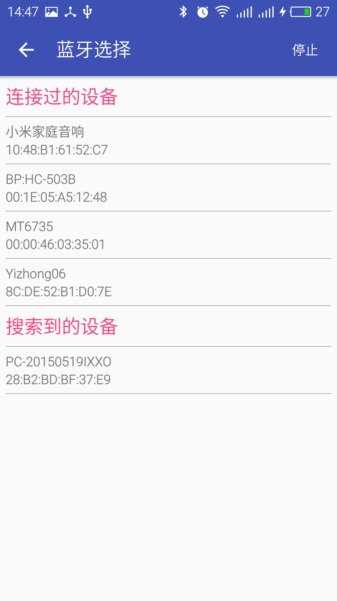
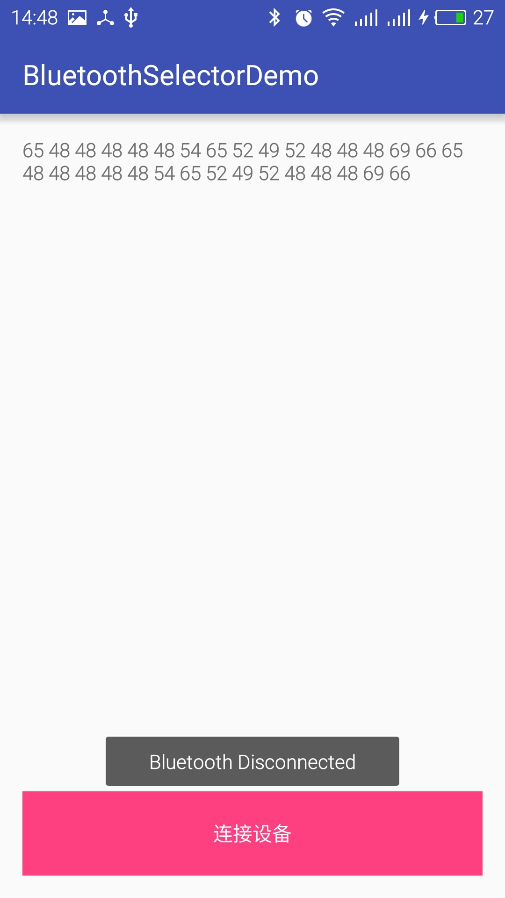

# BluetoothSelector
# 蓝牙选择器
---

## 功能

- 通过回调函数执行蓝牙连接成功后和断开后的动作
- 支持多蓝牙设备同时连接
- 选择界面可显示已配对设备，也可以搜索设备
- 可通过输入mac地址或者BluetoothDevice直接连接蓝牙
- 可选择是否出现等待界面（方便后台连接）
- 重连不重复开线程。
- 连接失败后返回Exception e
- 蓝牙选择界面、等待界面自定义（正在完善）


## 截图
|  |  |  |
| -------- | --------- | --------|
|  |  |  |
-----------------

## 引用

#### Gradle:

> compile 'cc.liyongzhi.bluetoothselector:bluetoothselector:1.7'


## 使用
在需要连接蓝牙或者选择设备的地方加入代码，本例为位于OnClickListener里。

- 输入为`Context`、`BluetoothConnectCallback`时：
```java
mButton.setOnClickListener(new View.OnClickListener() {
    @Override
    public void onClick(View v) {
        //以下为调用本库，输入为Context、BluetoothConnectCallback
        MedBluetooth.connectBluetooth(mContext, new BluetoothConnectCallback() {
            @Override
            // 连接成功后调用。
            public void connected(BluetoothSocket socket, BluetoothDevice device, Exception e) {
                //输出为获得的socket，可以自行存到全局变量里进行数据输入输出操作。
                //device为本次连接的设备，可调用 device.getAddress() 获得mac地址。
                //e 为错误。
            }

            @Override
            // 连接断开后调用
            public void disconnected() {
                // 原理为通过捕获系统的广播而调用的。
            }
        });
        //调用结束
    }
});
```

- 输入还可以为`Context`、`String（mac地址）`、`Boolean（是否显示等待界面）`、`BluetoothConnectCallback`，可以用于重连，代码几乎同上。

## 更新历史

#### 2016.5.31 version 1.7

可用版本。


## Bug

目前公司几款app均未发现bug。但有一处判断线程是否正在运行时使用了   
```java
if (!thread.isAlive() && thread.getState() != State.RUNNABLE) {
            thread.start();
}
```
不知道对不对。。。
