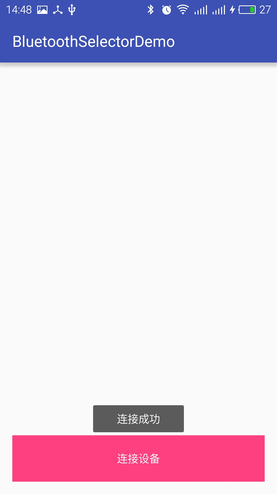

# BluetoothSelector
# 蓝牙选择器
---

## 功能

- 通过回调函数执行蓝牙连接成功后和断开后的动作
- 支持多蓝牙设备同时连接
- 集成读取数据的thread，可直接在回调函数中输入数据解析逻辑
- 选择界面可显示已配对设备，也可以搜索设备
- 可通过输入mac地址或者BluetoothDevice直接连接蓝牙
- 可选择是否出现等待界面（方便后台连接）
- 重连不重复开线程。
- 连接失败后返回Exception e
- 蓝牙选择界面、等待界面自定义（正在完善）


## 截图
|  |  |  |
| -------- | --------- | --------|
|  |  |  |
-----------------

## 引用

#### Gradle:

> compile 'cc.liyongzhi.bluetoothselector:bluetoothselector:1.9.1'


## 使用

若要在读取线程中实现复杂逻辑，则使用不集成读取线程的回调函数。若只是简单的逻辑，则可使用集成读取线程的回调函数，回调函数中只需根据返回的buffer和返回的buffer的size做相应逻辑实现即可。

##### 不集成读取线程：
``` java
/**
 * @param context 上下文
 * @param bluetoothConnectCallback 连接建立和取消连接后调用的回调函数
 */
MedBluetooth.connectBluetooth(Context context, BluetoothConnectCallback bluetoothConnectCallback);

```
或者

``` java
/**
 * @param context 上下文
 * @param mac 如果以前有保存蓝牙mac地址，则可以直接输入
 * @param showConnectBluetoothActivity 是否显示等待界面，若后台有自动重连请设置为false，不然每次连接都转圈圈。。。
 * @param bluetoothConnectCallback 连接建立和取消连接后调用的回调函数
 */
MedBluetooth.connectBluetooth(Context context, String mac, Boolean showConnectBluetoothActivity, BluetoothConnectCallback bluetoothConnectCallback);

```

`BluetoothConnectCallback`有两个方法：
```java
/**
 * 连接成功或失败后调用
 * @param socket 获得的socket
 * @param device 本次连接的设备，可存下来方便下次自动重连，就不用每次都选择了。
 * @param e 错误
 */
public abstract void connected(BluetoothSocket socket, BluetoothDevice device, Exception e);

/**
 * 连接断开后调用，原理为监听系统广播
 */
public abstract void disconnected();
```

##### 集成读取线程：

```java
/**
 * @param context 上下文
 * @param bluetoothConnectWithDataManageCallback 连接建立和取消连接后调用的回调函数,并在建立连接后开启读取线程，断开连接后结束读取线程。
 */
MedBluetooth.connectBluetooth(Context context, BluetoothConnectWithDataManageCallback bluetoothConnectWithDataManageCallback);
```

或者

``` java
/**
 * @param context 上下文
 * @param mac 如果以前有保存蓝牙mac地址，则可以直接输入
 * @param showConnectBluetoothActivity 是否显示等待界面，若后台有自动重连请设置为false，不然每次连接都转圈圈。。。
 * @param bluetoothConnectWithDataManageCallback 连接建立和取消连接后调用的回调函数,并在建立连接后开启读取线程，断开连接后结束读取线程。
 */
MedBluetooth.connectBluetooth(Context context, String mac, Boolean showConnectBluetoothActivity, BluetoothConnectWithDataManageCallback bluetoothConnectWithDataManageCallback);

```

`BluetoothConnectWithDataManageCallback`有三个方法：
```java
/**
 * 处理读取到的数据的函数，后台会有一个循环读取，若没有错误产生且有数据，则每次读取会有一个buffer，以及buffer的大小bytes。
 * @param bytes 本次读取到的字节数
 * @param buffer 字节存到这个数组中
 * @param e 错误
 */
public abstract void dataMange(int bytes, byte[] buffer, Exception e);
/**
 * 连接成功或失败后调用
 * @param socket 获得的socket
 * @param device 本次连接的设备，可存下来方便下次自动重连，就不用每次都选择了。
 * @param e 错误
 */
public abstract void connected(BluetoothSocket socket, BluetoothDevice device, Exception e);

/**
 * 连接断开后调用，原理为监听系统广播
 */
public abstract void disconnected();
```

#### 示例（不带读取数据线程，带读取线程请查看demo）：
在需要连接蓝牙或者选择设备的地方加入代码，本例为位于OnClickListener里。

- 输入为`Context`、`BluetoothConnectCallback`时：
```java
mButton.setOnClickListener(new View.OnClickListener() {
    @Override
    public void onClick(View v) {
        //以下为调用本库，输入为Context、BluetoothConnectCallback
        MedBluetooth.connectBluetooth(mContext, new BluetoothConnectCallback() {
            @Override
            // 连接成功或失败后调用。
            public void connected(BluetoothSocket socket, BluetoothDevice device, Exception e) {
                if (e != null) {
                    //连接失败
                } else {
                    //输出为获得的socket，可以自行存到全局变量里进行数据输入输出操作。
                    //device为本次连接的设备，可调用 device.getAddress() 获得mac地址。
                    //e 为错误。
                }
            }
            @Override
            // 连接断开后调用
            public void disconnected() {
                // 原理为通过捕获系统的广播而调用的。
            }
        });
        //调用结束
    }
});
```

- 输入还可以为`Context`、`String（mac地址）`、`Boolean（是否显示等待界面）`、`BluetoothConnectCallback`，可以用于重连，代码几乎同上。


## 更新历史

#### 2016.9.3 version 1.9.3

蓝牙连接与断开时发送广播，包涵状态改变设备的mac地址。

#### 2016.8.23 version 1.9.1

更新gradle引用

#### 2016.6.3 version 1.9

集成读取数据的thread

#### 2016.6.1 version 1.8

修复可能的线程运行完后又被start问题。

#### 2016.5.31 version 1.7

可用版本。


## Bug


## 作者
微博：这是一条特立独行的猪 http://weibo.com/1881962417/ 欢迎关注！
